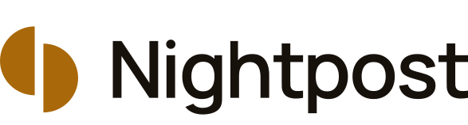

  <picture>
    <source media="(prefers-color-scheme: dark)" srcset="docs/img/lockup-dark.svg">
    <source media="(prefers-color-scheme: light)" srcset="docs/img/lockup-light.svg">
    
  </picture>

### Kyrylo Myloserdov

19, Ukrainian, a student at VŠB – Technical University of Ostrava, Czechia.

Я українець, живу в Остраві.

**Nightpost, in two lines.** Going out takes five apps and one friend who pays — the venue, the invite, the map, the split, the payback. Nightpost turns that into one evening, settled on Solana.

**What I build.** Nightpost: an Android messenger, a map and a bill split paid on Solana's test network, built since April 2026 by an orchestrated fleet of AI coding agents I direct. A cofounder joined on 7 October 2026.

**Status, honestly.** Devnet only. Zero users, zero venues today.

### Links

- **[Showcase on GitHub](https://github.com/Kiril003/phantom-solana)** — the pitch, the scenes, and how to verify.
- **[phantom-os.dev](https://phantom-os.dev)** — the Android build, free to download.
- **[Colosseum project](https://colosseum.com/arena/projects/nightpost)**

© 2026 Kyrylo Myloserdov. All rights reserved.
