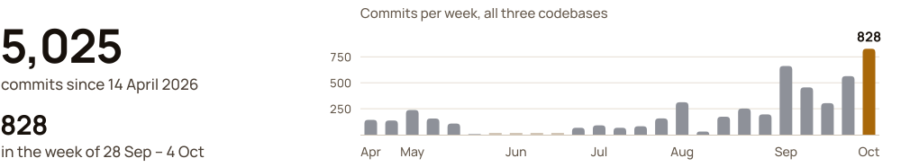

<picture>
  <source media="(prefers-color-scheme: dark)" srcset="docs/header-dark.svg">
  <source media="(prefers-color-scheme: light)" srcset="docs/header-light.svg">
  
</picture>

I'm Kyrylo: 19, Ukrainian, a student at VŠB – Technical University of Ostrava in Czechia. I build **Nightpost**, an Android app for the hours when the network is gone: in blackouts, under jamming and after disasters, people still need to reach their family, find a shelter and pay. I build it as a solo founder, orchestrating a fleet of AI coding agents.

Я українець, живу в Остраві. Знаю, як це — коли гасне світло.

### Now

<picture>
  <source media="(prefers-color-scheme: dark)" srcset="docs/img/lockup-dark.svg">
  <source media="(prefers-color-scheme: light)" srcset="docs/img/lockup-light.svg">
  
</picture>

Messages, maps and money that keep working when the network doesn't. One Android app, an early version, not in a store yet.

**[Showcase on GitHub](https://github.com/Kiril003/phantom-solana)** &nbsp;·&nbsp; **[phantom-os.dev](https://phantom-os.dev)**<!-- SLOT:film: when the film is online, add here:  &nbsp;·&nbsp; **[Film](FILM_URL)** -->

<!-- SLOT:screens: real device screenshots. When docs/img/screen-01.png to screen-06.png exist, delete this line and the SLOT:screens end line below, and check each alt text against the picture.

  &nbsp;
  &nbsp;
  &nbsp;
  &nbsp;
  &nbsp;
  

SLOT:screens end -->

<!-- SLOT:demo-gif: when docs/img/demo.gif exists (under 1.5 MB), delete this line and the SLOT:demo-gif end line below.

SLOT:demo-gif end -->

**Works today**
- Messages between phones on the same Wi-Fi go directly, even with no internet.
- A message waits on our server for up to 7 days while the other person is offline. Only the two of you can read it.
- The nearest shelter in Ukraine, even with no internet.

**Being tested**
- Messages through our server across different phones.
- Cash notes between two real phones. The full cycle ran on Solana's test network (devnet) with the app's own code, on a computer: signed offline, cashed once, a copy refused. [One of the records](https://explorer.solana.com/tx/5u377JHTiKakSqVdN3QB33qeQLUFxNBpx8vRmqAb83yRCHPRARt4XJWvqn9oZT3Pa1XYC5tH3sPrA9MdFBY9i3JT?cluster=devnet).

**Not yet**
- Messages between phones lying next to each other, without a shared Wi-Fi.
- Real money. Devnet only; mainnet comes after an independent audit.
- Shelters for other countries.

### How I build

One founder and a fleet of AI coding agents. I set the direction, write the briefs and decide what ships; the agents write, test and verify in parallel, one branch per topic, behind test gates. Two house rules: a change lands together with a test that fails without it, and a status like the one above is never rounded up.

<picture>
  <source media="(prefers-color-scheme: dark)" srcset="docs/stats-dark.svg">
  <source media="(prefers-color-scheme: light)" srcset="docs/stats-light.svg">
  
</picture>

Counted from git on 4 October 2026 across Nightpost's three private codebases: the Android app, the web messenger and its backend, the website and its account server.

### Reach me

Through **[phantom-os.dev](https://phantom-os.dev)**.

© 2026 Kyrylo Myloserdov. All rights reserved.
